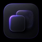

  
  <h1>HiddenSpace</h1>
  
<strong>A privacy-focused app hiding tweak for jailbroken iOS.</strong>

> **Public showcase repository.** The HiddenSpace source code is intentionally not published here.

## Overview

HiddenSpace is a rootless jailbreak tweak that lets users hide selected applications from normal SpringBoard presentation while keeping the applications installed and accessible through the intended HiddenSpace workflow.

## Features

- Hide selected apps from the Home Screen.
- Hide selected apps from the Dock.
- Hide selected apps inside opened folders and from folder-cover presentation.
- Dedicated **Hidden Space** page for selected applications.
- Optional Face ID / Touch ID protection where supported by the device.
- Live configuration updates without requiring a Respring for ordinary preference changes.
- App Library remains available by design.
- Presentation-focused behavior: HiddenSpace does not uninstall apps or intentionally modify persistent SpringBoard icon-layout databases.

## Compatibility

| Item | Status |
| --- | --- |
| Jailbreak packaging | Rootless |
| Architectures | arm64 / arm64e |
| Deployment target | iOS 15.0 |
| Intended system range | iOS 15.x – iOS 17.x |

### Current validation status

The current beta has **not completed device acceptance across the entire iOS 15–17 range**. Compatibility is capability-gated and is being verified on real devices.

- **iOS 15:** test candidate; real-device verification requested.
- **iOS 16:** development baseline includes iOS 16.6 / Dopamine, but the current beta revision still requires acceptance testing.
- **iOS 17:** test candidate; real-device verification requested.

Please do not interpret the intended iOS 15–17 range as a guarantee for every device, minor iOS release, or jailbreak environment until testing is complete.

## Privacy

HiddenSpace is designed to work without a developer-operated backend service.

- No analytics SDK.
- No advertising SDK.
- No intentional telemetry or device tracking.
- No collection of UDID, IMEI, serial number, Apple ID, or phone number.
- No developer-operated account system.

A third-party package repository may maintain its own download statistics and privacy practices independently of HiddenSpace.

See [PRIVACY.md](PRIVACY.md) for the public privacy statement.

## Beta testing

If you are testing HiddenSpace, please include the following when reporting compatibility results:

- iPhone / iPad model
- Exact iOS version
- Jailbreak and version
- HiddenSpace version
- Whether Home Screen, Dock, folders, Hidden Space, authentication, and restoration after disabling work correctly

See [TESTING.md](TESTING.md) for the test checklist.

## Distribution

HiddenSpace is intended to be distributed as a free jailbreak tweak. A Havoc release is planned after compatibility testing and package review.

## Source code and rights

This repository is a **product showcase**, not an open-source code repository. HiddenSpace's implementation source is not included.

Unless explicitly stated otherwise, no license is granted to reproduce, redistribute, repackage, impersonate, or commercially sell HiddenSpace or its branding from the materials in this repository.

© 2026 KaileeDev. All rights reserved.
